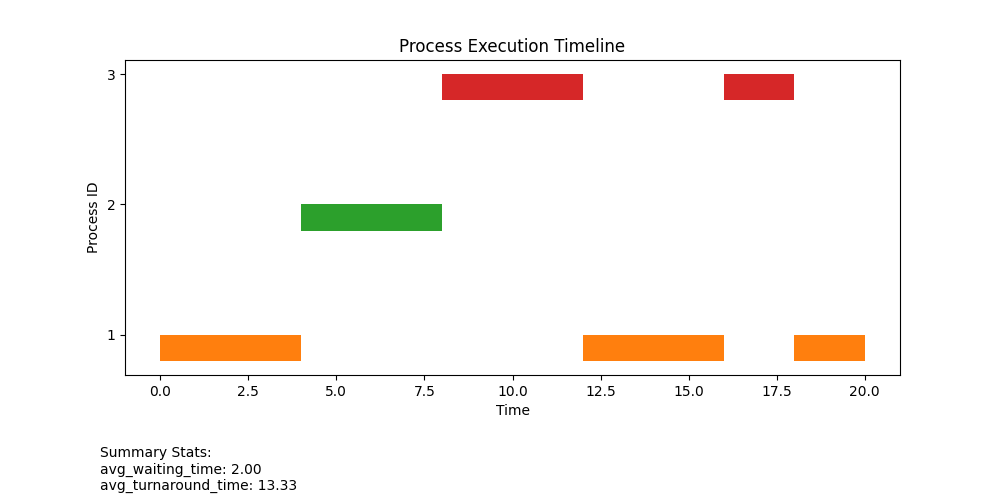
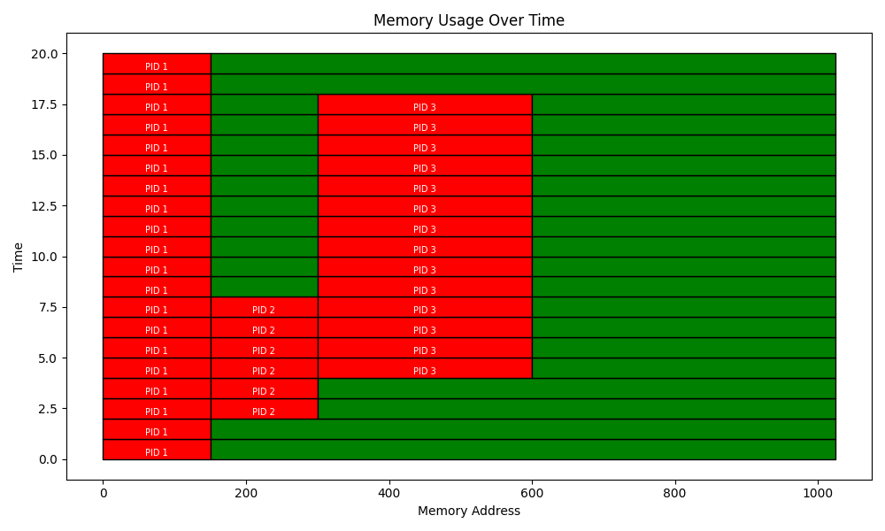

# OS Simulator

This project simulates CPU scheduling and memory allocation algorithms. It supports:

- **Scheduling Algorithms**: FCFS (First-Come-First-Serve), RR (Round Robin)
- **Memory Allocation Strategies**: First Fit, Best Fit
- **Visualization**: Gantt charts and memory usage timelines using `matplotlib`

## Running with Docker

### 1. Clone the Repository
```bash
git clone https://github.com/leragogogo/os_simulator.git
cd os_simulator
```

### 2. Build the Docker Image
```bash
docker build -t os_simulator .
```

### 3. Run the App
```bash
docker run --rm -v $(pwd):/app os_simulator \
    --file processes.json \
    --scheduler RR \
    --quantum 4 \
    --memory 1024 \
    --strategy first_fit
```

Then the Gantt charts will be saved in charts folder.

### 4. Results Example (RR and First Fit)

#### Input JSON:

```bash
{
  "processes": [
    {
      "process_id": 1,
      "arrival_time": 0,
      "burst_time": 10,
      "memory_required": 150
    },
    {
      "process_id": 2,
      "arrival_time": 2,
      "burst_time": 4,
      "memory_required": 150
    },
    {
      "process_id": 3,
      "arrival_time": 4,
      "burst_time": 6,
      "memory_required": 300
    }
  ]
}
```

#### Output:
  
- Processes execution


- Memory Timeline


## CLI Options

| Option         | Description                                               | Default     |
|----------------|-----------------------------------------------------------|-------------|
| `--file`       | Path to the input JSON file (required)                    | —           |
| `--scheduler`  | Scheduling algorithm (`FCFS` or `RR`)                     | `FCFS`      |
| `--quantum`    | Time quantum (only for Round Robin)                       | `4`         |
| `--memory`     | Total available memory                                    | `1024`      |
| `--strategy`   | Memory allocation strategy (`first_fit` or `best_fit`)    | `first_fit` |
